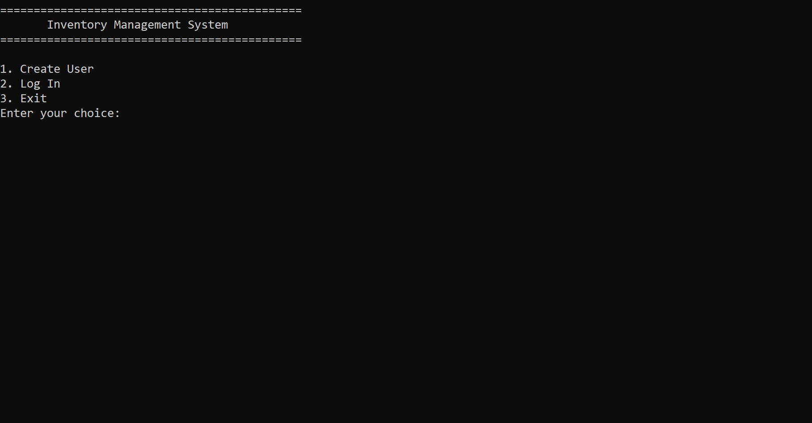
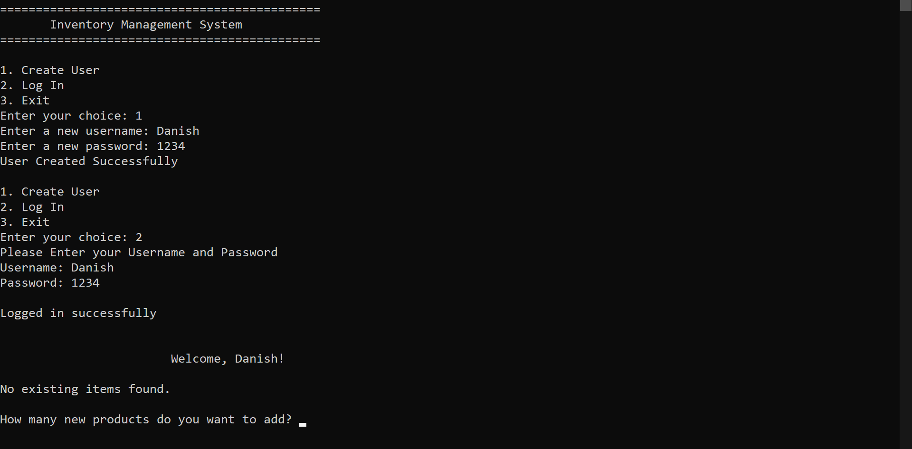
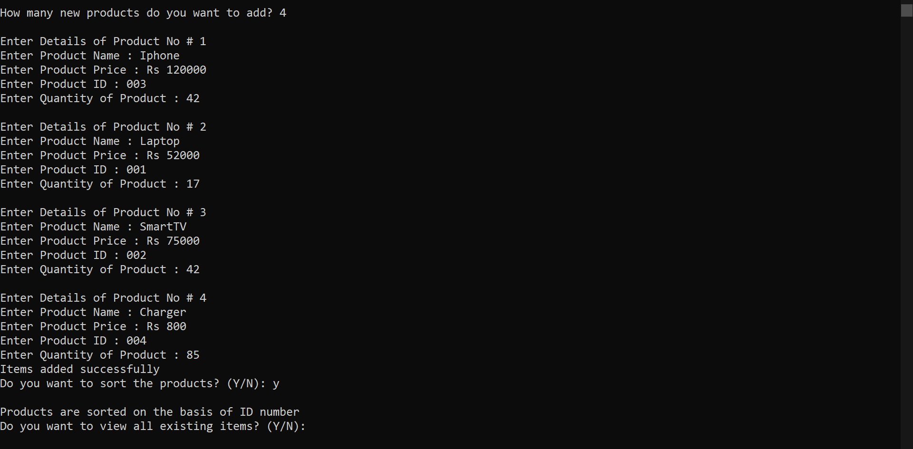
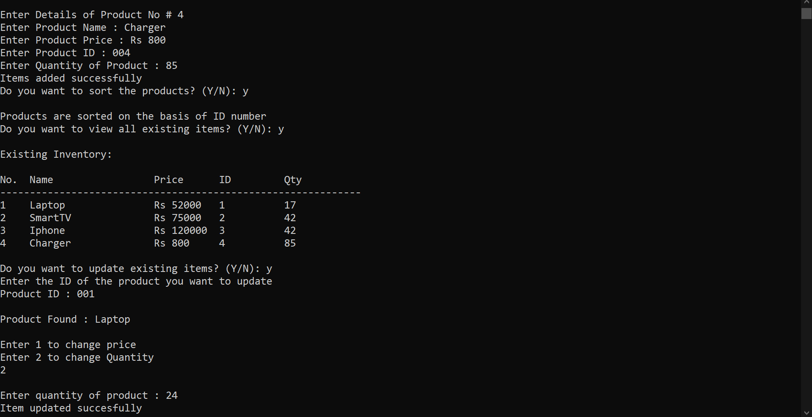

# Inventory Management System (C CLI)

A terminal-based inventory manager in C that supports user registration, login, item entry, updates, and persistent storage.

---

## ✅ Features

- 🔐 User login & registration (`credentials.txt`)
- 📦 Each user has their own inventory (`username_inventory.txt`)
- ➕ Add, update, and view products
- 🔄 Sort products by ID
- 💾 Data persistence via text files

---

## 📁 Folder Structure

```
inventory-management-system/
├── src/
│   └── inventory.c               # C source code
├── assets/
│   ├── main-menu.png             # Initial menu
│   ├── user-registration.png     # Register screen
│   ├── user-login-add-items.png  # Login + add
│   └── display-update-items.png  # View & update
├── credentials.txt               # Login credentials (auto-generated)
├── *.txt                         # Inventory files (e.g., danish_inventory.txt)
└── README.md
```

---

## 🛠️ Technologies Used

- C Language
- Command Line Interface
- File I/O for persistence

---

## 🚀 How to Run

### ▶️ Compile
```bash
gcc src/inventory.c -o inventory
```

### 🏃 Execute
```bash
./inventory
```

Then follow the on-screen menu:
```
1. Create User
2. Log In
3. Exit
```

---

## 🖼️ Screenshots

### 🏁 Main Menu  


### 🧑‍💻 Registration & Login  


### ➕ Add Items  


### 🧾 View/Update  


---

## 📌 Notes

- Inventory auto-saves per user
- Sorting is optional
- Previous items load on login
- Update by entering item ID

---

## 👤 Author

**Muhammad Danish Jawad**  
[GitHub Profile](https://github.com/danishjawad)
